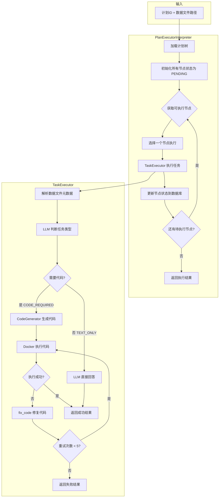
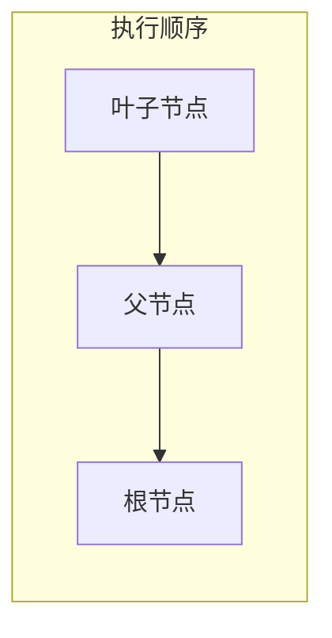
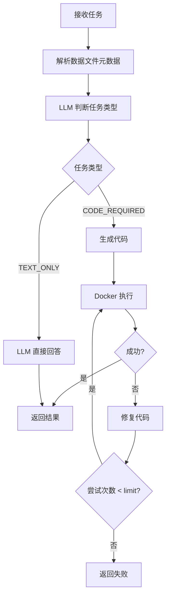
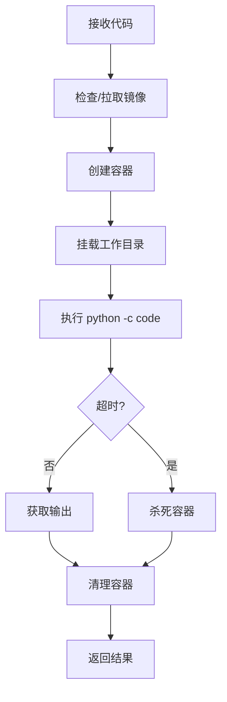
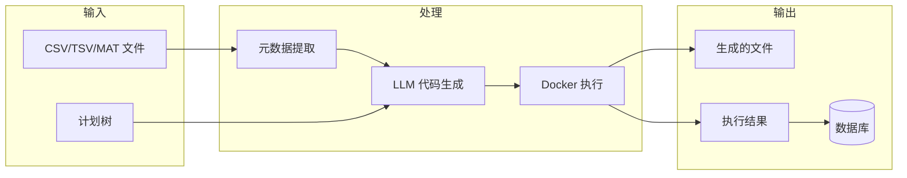

# Interpreter 模块工作流程文档

本文档描述了 `interpreter` 模块的整体架构和执行流程。该模块负责将计划树中的任务节点转化为可执行的代码，并在 Docker 容器中安全执行。

## 模块架构

```
interpreter/
├── metadata.py           # 数据文件元数据解析
├── coder.py              # LLM 代码生成器
├── docker_interpreter.py # Docker 代码执行器
├── task_executer.py      # 单任务执行器（整合生成+执行）
├── plan_execute.py       # 计划树执行器（执行整个计划）
└── prompts/              # 提示词模板
    ├── coder_prompt.py
    └── task_executer.py
```

## 核心组件

| 组件 | 职责 |
|------|------|
| `DataProcessor` | 解析 CSV/TSV/MAT 数据文件，提取元数据 |
| `CodeGenerator` | 调用 LLM 生成 Python 代码，支持错误修复 |
| `DockerCodeInterpreter` | 在隔离的 Docker 容器中执行代码 |
| `TaskExecutor` | 协调代码生成和执行的完整流程 |
| `PlanExecutorInterpreter` | 按依赖顺序执行整个计划树 |

---

## 整体流程图



---

## 详细流程说明

### 1. 计划树执行流程 (PlanExecutorInterpreter)



**执行规则：**
- 从**叶子节点**开始执行，逐层向上
- 节点可执行条件：
  1. 状态为 `PENDING`
  2. 是叶子节点，或所有子节点已完成
  3. 所有依赖节点已完成
- 子节点的执行结果会作为**上下文**传递给父节点

**数据库持久化：**
每个节点执行完成后，将结果保存到数据库的 `execution_result` 字段：
```json
{
  "task_type": "code_required",
  "code": "import pandas as pd\n...",
  "code_description": "计算平均分",
  "code_output": "平均分: 78.0",
  "text_response": null,
  "generated_files": [],
  "error": null
}
```

### 2. 单任务执行流程 (TaskExecutor)



**任务类型判断：**
- `CODE_REQUIRED`: 需要编写代码的任务（计算、绘图、数据处理）
- `TEXT_ONLY`: 纯文本任务（解释、总结、问答）

**错误修复机制：**
- 代码执行失败后，自动调用 `fix_code` 修复
- 最多重试 **5 次**
- 每次将错误信息传递给 LLM 进行修复

### 3. Docker 代码执行 (DockerCodeInterpreter)



**安全特性：**
- `network_disabled=True` - 禁用网络
- `mem_limit="512m"` - 内存限制
- 超时自动终止
- 容器用后即删

**文件挂载：**
```
宿主机数据目录 → /workspace (容器)
```

---

## 数据流向



---

## 使用示例

### 执行整个计划

```python
from app.services.interpreter.plan_execute import execute_plan

result = execute_plan(
    plan_id=1,
    data_file_path="/path/to/data.csv",
    output_dir="./results"
)

print(f"成功: {result.success}")
print(f"完成节点: {result.completed_nodes}/{result.total_nodes}")
```

### 执行单个任务

```python
from app.services.interpreter.task_executer import execute_task

result = execute_task(
    data_file_path="/path/to/data.csv",
    task_title="计算平均值",
    task_description="计算 score 列的平均值"
)

if result.success:
    print(f"代码输出: {result.code_output}")
else:
    print(f"错误: {result.error_message}")
```

---

## 配置参数

| 参数 | 默认值 | 说明 |
|------|--------|------|
| `llm_provider` | `"qwen"` | LLM 提供商 |
| `docker_image` | `"agent-plotter"` | Docker 镜像名称 |
| `docker_timeout` | `120` (秒) | 代码执行超时时间 |
| `max_fix_attempts` | `5` | 代码修复最大尝试次数 |

---

## 错误处理

1. **代码生成失败**: 返回空代码，标记任务失败
2. **代码执行失败**: 自动调用 fix_code 修复，最多重试 5 次
3. **Docker 超时**: 强制终止容器，返回超时错误
4. **节点执行失败**: 记录错误，继续执行其他可执行节点
