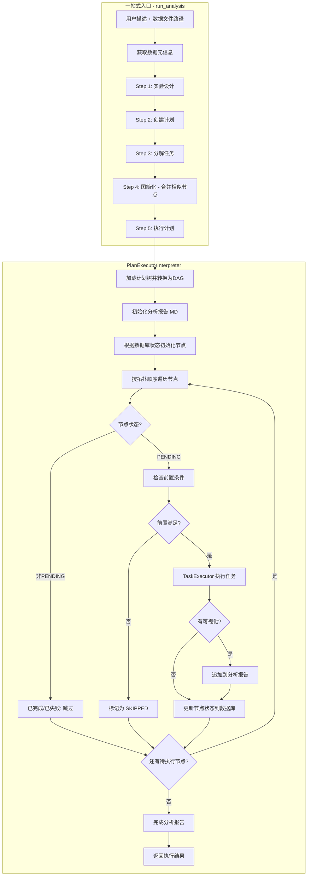
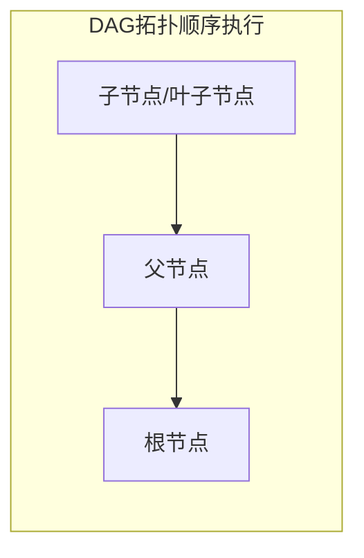
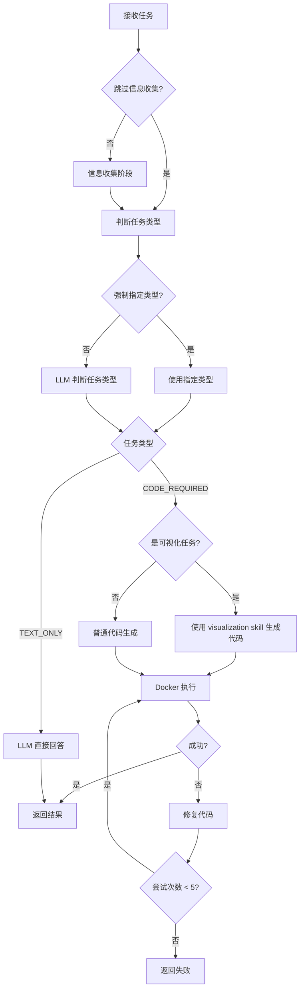
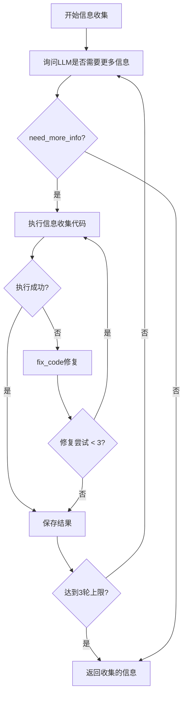
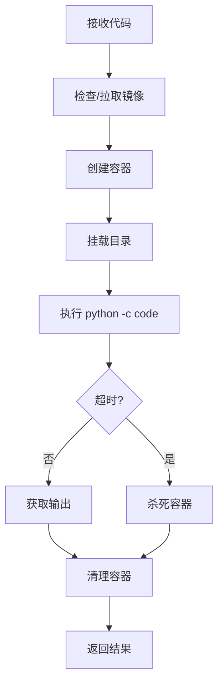
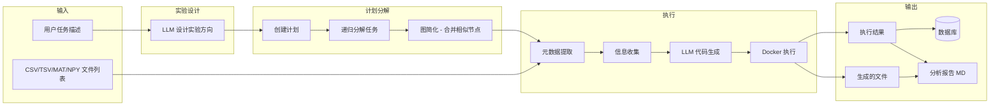

# Interpreter 模块工作流程文档

本文档描述了 `interpreter` 模块的整体架构和执行流程。该模块负责将计划树中的任务节点转化为可执行的代码，并在 Docker 容器中安全执行。

## 模块架构

```
interpreter/
├── interpreter.py        # 一站式数据分析入口（run_analysis）
├── metadata.py           # 数据文件元数据解析
├── coder.py              # LLM 代码生成器
├── docker_interpreter.py # Docker 代码执行器
├── task_executer.py      # 单任务执行器（整合生成+执行）
├── plan_execute.py       # 计划树执行器（执行整个计划）
└── prompts/              # 提示词模板
    ├── coder_prompt.py       # 代码生成提示词
    ├── experiment_design.py  # 实验设计提示词
    ├── plan_execute_prompt.py # 计划执行提示词
    └── task_executer.py      # 任务执行提示词（任务分类、信息收集）
```

## 核心组件

| 组件 | 职责 |
|------|------|
| `run_analysis` | 一站式入口：实验设计 → 创建计划 → 分解任务 → 图简化 → 执行 |
| `DataProcessor` | 解析 CSV/TSV/MAT/NPY 数据文件，提取元数据 |
| `CodeGenerator` | 调用 LLM 生成 Python 代码，支持错误修复、可视化分析和 Skills 加载 |
| `DockerCodeInterpreter` | 在隔离的 Docker 容器中执行代码 |
| `TaskExecutor` | 协调信息收集、代码生成和执行的完整流程 |
| `PlanExecutorInterpreter` | 按 DAG 拓扑顺序执行整个计划树，生成分析报告 |
| `TreeSimplifier` | 合并相似节点，将计划树转换为 DAG 结构 |

---

## 整体流程图



---

## 一站式流程 (run_analysis)

完整的端到端数据分析流程：

```mermaid
flowchart LR
    subgraph 输入
        I1[用户任务描述]
        I2[数据文件路径列表]
    end
    
    subgraph Step1 [Step 1: 实验设计]
        S1A[解析数据元信息]
        S1B[LLM 设计 2-4 个实验方向]
        S1C[增强任务描述]
    end
    
    subgraph Step2 [Step 2: 创建计划]
        S2A[创建 Plan 记录]
    end
    
    subgraph Step3 [Step 3: 分解任务]
        S3A[PlanDecomposer 递归分解]
        S3B[生成任务树结构]
    end
    
    subgraph Step4 [Step 4: 图简化]
        S4A[TreeSimplifier 分析相似度]
        S4B[合并相似节点]
        S4C[生成 DAG 结构]
    end
    
    subgraph Step5 [Step 5: 执行]
        S5A[PlanExecutorInterpreter]
        S5B[按拓扑顺序执行]
        S5C[生成分析报告]
    end
    
    I1 --> S1A
    I2 --> S1A
    S1A --> S1B
    S1B --> S1C
    S1C --> S2A
    S2A --> S3A
    S3A --> S3B
    S3B --> S4A
    S4A --> S4B
    S4B --> S4C
    S4C --> S5A
    S5A --> S5B
    S5B --> S5C
```



**实验设计阶段：**
- 基于用户描述和数据集信息，让 LLM 设计 2-4 个有意义的实验方向
- 设计原则：可操作性、科学性、互补性、渐进性
- 实验类型：描述性统计、比较分析、相关性分析、聚类分析、可视化分析、假设检验等

---

## 详细流程说明

### 1. 计划树执行流程 (PlanExecutorInterpreter)



**执行规则：**
- 加载计划树并转换为 **DAG 结构**
- 按 **拓扑顺序** 执行（反向：从叶子到根）
- 节点可执行条件：
  1. 状态为 `PENDING`
  2. 所有父节点（`parent_ids`）已完成或失败
  3. 所有显式依赖（`dependencies`）已完成或失败
- 父节点和依赖节点的执行结果会作为**上下文**传递给当前节点
- 如果子节点失败，父节点仍会尝试执行（记录警告）

**状态恢复支持：**
- 执行前会从数据库加载节点状态
- 已完成/失败的节点会跳过，支持断点续执行
- 每个节点执行后立即持久化到数据库

**多数据文件支持：**
- 支持传入多个数据文件 `data_file_paths: List[str]`
- 支持 CSV、TSV、MAT、NPY 格式
- 所有文件的元数据会被解析并传递给 LLM
- 可以进行单独分析或跨数据集比较分析

**分析报告自动生成：**
- 每个计划创建独立的 Markdown 报告文件
- 每次有可视化任务完成时，自动追加：目的 + 图表 + 分析
- 检测条件放宽：有 `has_visualization` 标记，或生成了图片文件（.png/.jpg/.svg/.pdf）
- 执行完成后添加统计总结

**数据库持久化：**
每个节点执行完成后，将结果保存到数据库的 `execution_result` 字段：
```json
{
  "task_type": "code_required",
  "code": "import pandas as pd\n...",
  "code_description": "计算平均分",
  "code_output": "平均分: 78.0",
  "text_response": null,
  "generated_files": ["results/chart.png"],
  "has_visualization": true,
  "visualization_purpose": "展示各组分数分布...",
  "visualization_analysis": "柱状图显示A组平均分78.5...",
  "error": null
}
```

### 2. 单任务执行流程 (TaskExecutor)



**信息收集阶段 (_gather_additional_info)：**
- 在代码生成之前，先询问 LLM 是否需要额外的数据信息
- 循环收集直到 LLM 表示信息充足（最多 **3 轮**）
- 每轮代码执行失败时最多尝试修复 **3 次**
- **关键：如果任务涉及可视化，会要求提前获取将要展示的具体数值**
- 收集的信息会传递给代码生成阶段



**任务类型判断：**
- `CODE_REQUIRED`: 需要编写代码的任务（计算、绘图、数据处理）
- `TEXT_ONLY`: 纯文本任务（解释、总结、问答）
- 支持 `force_code` 参数强制指定任务类型

**可视化任务处理（is_visualization=True）：**
- 使用 `SkillsLoader` 加载 `visualization-generator` skill 增强提示词
- 生成代码时调用 `generate_visualization()` 方法
- 修复代码时调用 `fix_visualization_code()` 方法
- 代码生成时会返回额外字段：
  - `has_visualization`: 是否包含可视化
  - `visualization_purpose`: 为什么画这个图，想分析什么
  - `visualization_analysis`: 图表展示什么结果，特征，计算公式等

**错误修复机制：**
- 代码执行失败后，自动调用 `fix_code` 或 `fix_visualization_code` 修复
- 最多重试 **5 次**（可配置 `max_fix_attempts`）
- 每次将错误信息（exit_code、stderr、stdout）传递给 LLM 进行修复

### 3. Docker 代码执行 (DockerCodeInterpreter)



**安全特性：**
- `network_disabled=True` - 禁用网络
- `mem_limit="512m"` - 内存限制
- 超时自动终止（默认 60 秒）
- 容器用后即删

**文件挂载（双目录模式）：**
```
宿主机工作目录 (output_dir) → /workspace (读写，用于输出文件)
宿主机数据目录 (data_dir)   → /data      (只读，用于读取数据文件)
```

如果 `data_dir` 未单独指定，则数据文件也从 `/workspace` 读取。

---

## 数据流向



---

## 使用示例

### 一站式分析（推荐）

```python
from app.services.interpreter.interpreter import run_analysis

result = run_analysis(
    description="分析销售数据趋势，生成可视化图表",
    data_paths=["data/sales.csv"],
    max_depth=3,
    node_budget=20
)

print(f"成功: {result.success}")
print(f"完成任务: {result.completed_tasks}/{result.total_tasks}")
print(f"生成文件: {result.generated_files}")
print(f"分析报告: {result.report_path}")
```

### 执行已有计划（多数据文件）

```python
from app.services.interpreter.plan_execute import execute_plan

result = execute_plan(
    plan_id=1,
    data_file_paths=[
        "/path/to/data1.csv",
        "/path/to/data2.csv"
    ],
    output_dir="./results"
)

print(f"成功: {result.success}")
print(f"完成节点: {result.completed_nodes}/{result.total_nodes}")
print(f"分析报告: {result.report_path}")
```

### 执行单个任务

```python
from app.services.interpreter.task_executer import execute_task

result = execute_task(
    data_file_paths=["/path/to/data.csv"],
    task_title="绘制销售趋势图",
    task_description="按月份绘制销售额趋势折线图",
    is_visualization=True  # 使用 visualization skill
)

if result.success:
    print(f"代码输出: {result.code_output}")
    if result.has_visualization:
        print(f"可视化目的: {result.visualization_purpose}")
        print(f"可视化分析: {result.visualization_analysis}")
else:
    print(f"错误: {result.error_message}")
```

---

## 配置参数

### run_analysis 参数

| 参数 | 默认值 | 说明 |
|------|--------|------|
| `description` | (必填) | 分析任务描述 |
| `data_paths` | (必填) | 数据文件路径列表 |
| `title` | 文件名 + " 数据分析" | 计划标题 |
| `output_dir` | `"./results"` | 输出目录 |
| `llm_provider` | `"qwen"` | LLM 提供商 |
| `max_depth` | `5` | 任务分解最大深度 |
| `node_budget` | `50` | 任务节点数量上限 |
| `docker_image` | `"agent-plotter"` | Docker 镜像名称 |
| `docker_timeout` | `7200` (秒) | Docker 执行超时时间 |

### TaskExecutor 参数

| 参数 | 默认值 | 说明 |
|------|--------|------|
| `llm_provider` | `"qwen"` | LLM 提供商 |
| `docker_image` | `"agent-plotter"` | Docker 镜像名称 |
| `docker_timeout` | `60` (秒) | 代码执行超时时间 |
| `max_fix_attempts` | `5` | 代码修复最大尝试次数 |
| `max_info_rounds` | `3` | 信息收集最大轮次 |
| `skip_info_gathering` | `False` | 是否跳过信息收集阶段 |
| `is_visualization` | `False` | 是否为可视化任务 |

---

## 分析报告结构

每个计划执行时会自动生成 Markdown 格式的分析报告：

```markdown
# 数据分析报告

**计划ID**: 1
**计划标题**: 销售数据分析
**生成时间**: 2026-01-11 10:00:00

---

## 任务: 绘制月度销售趋势
**任务ID**: 3
**执行时间**: 2026-01-11T10:01:00

### 分析目的
展示销售额随时间的变化趋势，识别季节性模式...

### 生成的图表


### 图表分析
折线图显示2023年销售额整体呈上升趋势。
Q1平均销售额: $120,000，Q4达到峰值$180,000...
计算方法: SUM(sales) GROUP BY month

---

## 执行总结

| 指标 | 数值 |
|------|------|
| 总任务数 | 5 |
| 完成 | 5 |
| 失败 | 0 |
| 跳过 | 0 |

**完成时间**: 2026-01-11 10:05:00
```

---

## 错误处理

1. **代码生成失败**: 返回空代码，标记任务失败
2. **代码执行失败**: 自动调用 `fix_code` 或 `fix_visualization_code` 修复，最多重试 5 次
3. **信息收集失败**: 每轮最多 3 次修复尝试，失败后记录错误继续下一轮
4. **Docker 超时**: 强制终止容器，返回超时错误
5. **节点执行失败**: 记录错误，父节点仍尝试执行（记录警告）
6. **前置条件未满足**: 节点标记为 SKIPPED，继续执行其他节点

---

## Skills 机制

`CodeGenerator` 支持加载 Skills 来增强代码生成能力：

```python
# 可视化任务会自动加载 visualization-generator skill
self._skills_loader.load_skill("visualization-generator")
```

Skills 目录结构：
```
skills/
├── visualization-generator/  # 可视化生成技能
└── senior-data-scientist/    # 高级数据分析技能
```

加载的 skill 会被注入到 LLM 提示词中，提供领域特定的指导。
