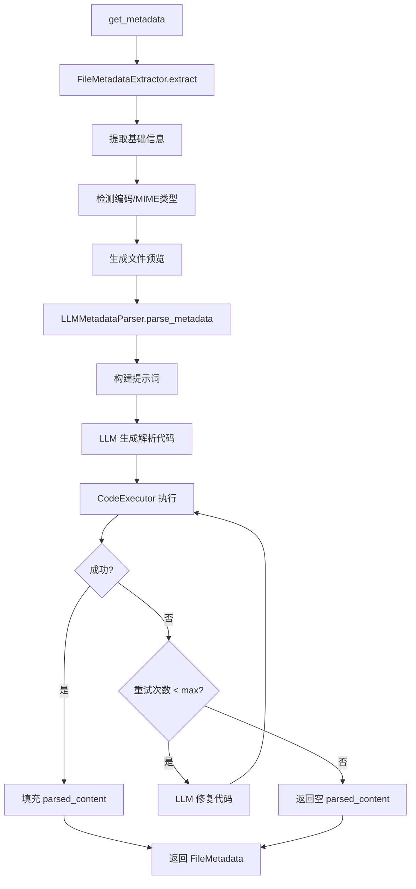

# Metadata 模块

该模块提供通用数据文件元数据提取功能，通过 LLM 生成解析代码来支持任意文件格式。

## 概述

`metadata.py` 模块负责从各种格式的数据文件中提取元数据信息。核心特点：
- **通用性**：通过 LLM 动态生成解析代码，支持任意文件格式
- **智能解析**：自动检测文件类型，提取关键元数据
- **自动修复**：代码执行失败时自动调用 LLM 修复

## 模块架构

```
interpreter/
├── metadata.py           # 核心模块：FileMetadata, LLMMetadataParser, get_metadata()
├── code_executor.py      # 本地代码执行器：CodeExecutor, ExecutionResult
└── prompts/
    └── metadata_parser_prompt.py  # LLM 提示词模板
```

## 支持的文件格式

由于使用 LLM 动态生成解析代码，理论上支持任意文件格式：

| 类型 | 扩展名 | 返回的 file_type |
|------|--------|------------------|
| 表格数据 | `.csv`, `.tsv`, `.xlsx`, `.parquet` | `tabular` |
| 数组数据 | `.npy`, `.mat`, `.hdf5` | `array` |
| 图像数据 | `.png`, `.jpg`, `.tiff` | `image` |
| JSON 数据 | `.json` | `json` |
| 其他 | 任意 | 由 LLM 决定 |

## 数据模型

### FileMetadata

通用文件元数据模型，包含基础信息和 LLM 解析结果。

```python
class FileMetadata(BaseModel):
    # ===== 通用信息（直接提取）=====
    filename: str                           # 文件名（不含路径）
    file_path: str                          # 完整文件路径
    file_extension: str                     # 文件扩展名
    file_size_bytes: int                    # 文件大小（字节）
    mime_type: Optional[str] = None         # MIME 类型
    is_binary: bool = False                 # 是否为二进制文件
    encoding: Optional[str] = None          # 文件编码（文本文件）
    created_time: Optional[str] = None      # 创建时间（ISO 格式）
    modified_time: Optional[str] = None     # 修改时间（ISO 格式）
    
    # ===== 预览信息 =====
    raw_preview: Optional[str] = None       # 文件头部预览
    preview_lines: int = 0                  # 预览行数（文本文件）
    preview_bytes: int = 0                  # 预览字节数
    
    # ===== LLM 解析结果 =====
    parsed_content: Optional[dict] = None   # LLM 生成代码解析后的结果
```

### parsed_content 结构

根据文件类型不同，`parsed_content` 字典包含不同的字段：

**表格数据 (file_type: "tabular")**
```python
{
    "file_type": "tabular",
    "total_rows": 10000,
    "total_columns": 5,
    "columns": [  # 最多前 20 列
        {
            "name": "id",
            "dtype": "int64",
            "sample_values": [1, 2, 3],  # 最多 3 个
            "null_count": 0
        },
        ...
    ],
    "sample_rows": [...]  # 最多前 5 行
}
```

**数组数据 (file_type: "array")**
```python
{
    "file_type": "array",
    "shape": [100, 50],
    "dtype": "float64",
    "ndim": 2,
    "size": 5000,
    "sample_values": [1.0, 2.0, 3.0],  # 最多 3 个
    "min": 0.0,
    "max": 100.0,
    "mean": 50.0
}
```

**图像数据 (file_type: "image")**
```python
{
    "file_type": "image",
    "width": 1920,
    "height": 1080,
    "channels": 3,
    "format": "PNG",
    "mode": "RGB"
}
```

**JSON 数据 (file_type: "json")**
```python
{
    "file_type": "json",
    "keys": ["key1", "key2", ...],  # 最多 20 个
    "total_keys": 50,
    "sample_data": {...}
}
```

## 核心组件

### get_metadata() 函数

**单一入口点**：获取文件完整元数据，包含 LLM 解析结果。

```python
def get_metadata(file_path: str, max_attempts: int = 3) -> FileMetadata:
    """
    获取文件元数据（包含 LLM 解析的 parsed_content）
    
    Args:
        file_path: 文件路径
        max_attempts: 最大重试次数（代码执行失败时自动修复重试）
    
    Returns:
        FileMetadata: 包含完整元数据的对象
    """
```

### LLMMetadataParser

调用 LLM 生成解析代码并执行。

```python
class LLMMetadataParser:
    def __init__(self, llm_client=None, provider: str = "qwen"):
        ...
    
    def parse(self, file_path: str, max_attempts: int = 3) -> FileMetadata:
        """解析文件并返回完整元数据"""
        ...
    
    def parse_metadata(self, metadata: FileMetadata, max_attempts: int = 3) -> FileMetadata:
        """基于已有基础元数据，调用 LLM 解析并填充 parsed_content"""
        ...
```

### FileMetadataExtractor

提取文件基础信息（不调用 LLM）。

```python
class FileMetadataExtractor:
    @staticmethod
    def extract(file_path: str, preview_lines: int = 20, preview_bytes: int = 512) -> FileMetadata:
        """提取文件基础元数据（不含 parsed_content）"""
        ...
```

### CodeExecutor

本地 Python 代码执行器（用于执行 LLM 生成的解析代码）。

```python
class CodeExecutor:
    def execute(self, code: str, globals_dict: dict = None) -> ExecutionResult:
        """执行 Python 代码"""
        ...
    
    def execute_with_retry(self, code: str, max_attempts: int = 3, 
                           fix_code_func=None, **kwargs) -> ExecutionResult:
        """执行代码，失败时调用 fix_code_func 修复并重试"""
        ...
```

## 使用示例

### 基本用法

```python
from app.services.interpreter.metadata import get_metadata

# 获取文件元数据（自动调用 LLM 解析）
metadata = get_metadata("data/sales.csv")

print(f"文件名: {metadata.filename}")
print(f"扩展名: {metadata.file_extension}")
print(f"大小: {metadata.file_size_bytes} bytes")

# 访问 LLM 解析结果
if metadata.parsed_content:
    pc = metadata.parsed_content
    print(f"类型: {pc.get('file_type')}")
    print(f"行数: {pc.get('total_rows')}")
    print(f"列数: {pc.get('total_columns')}")
    
    for col in pc.get("columns", [])[:5]:
        print(f"  - {col['name']}: {col['dtype']}")
```

### 多数据集处理

```python
from app.services.interpreter.metadata import get_metadata

file_paths = [
    "data/sales_2023.csv",
    "data/model_weights.npy",
    "data/config.json"
]

for path in file_paths:
    meta = get_metadata(path)
    pc = meta.parsed_content or {}
    file_type = pc.get("file_type", "unknown")
    print(f"{meta.filename}: {file_type}")
```

### 仅提取基础信息（不调用 LLM）

```python
from app.services.interpreter.metadata import FileMetadataExtractor

# 只提取基础信息，不调用 LLM
basic_meta = FileMetadataExtractor.extract("data/large_file.csv")
print(f"文件: {basic_meta.filename}")
print(f"MIME: {basic_meta.mime_type}")
print(f"编码: {basic_meta.encoding}")
print(f"预览:\n{basic_meta.raw_preview}")
```

### 自定义 LLM 客户端

```python
from app.services.interpreter.metadata import LLMMetadataParser
from app.llm import LLMClient

# 使用自定义 LLM 客户端
llm_client = LLMClient(provider="openai")
parser = LLMMetadataParser(llm_client=llm_client)

metadata = parser.parse("data/experiment.mat", max_attempts=5)
```

## 工作流程



## 提示词模板

位于 `prompts/metadata_parser_prompt.py`：

| 模板 | 用途 |
|------|------|
| `METADATA_PARSER_USER_PROMPT` | 生成解析代码的主提示词 |
| `CODE_FIX_PROMPT` | 代码执行失败时的修复提示词 |
| `CODE_FORMAT_FIX_PROMPT` | 代码格式不正确时的修复提示词 |

### 输出限制

为避免输出过大，LLM 生成的代码会遵循以下限制：

- `sample_values`: 最多 3 个
- `sample_rows`: 最多 5 行
- `columns`: 最多展示前 20 列
- `keys`: 最多展示前 20 个键

## 注意事项

1. **首次调用较慢**：需要调用 LLM 生成解析代码
2. **网络依赖**：需要 LLM API 连接
3. **自动重试**：代码执行失败会自动修复重试（默认 3 次）
4. **本地执行**：解析代码在本地 Python 环境执行（非 Docker）
5. **编码检测**：文本文件使用 chardet 自动检测编码
